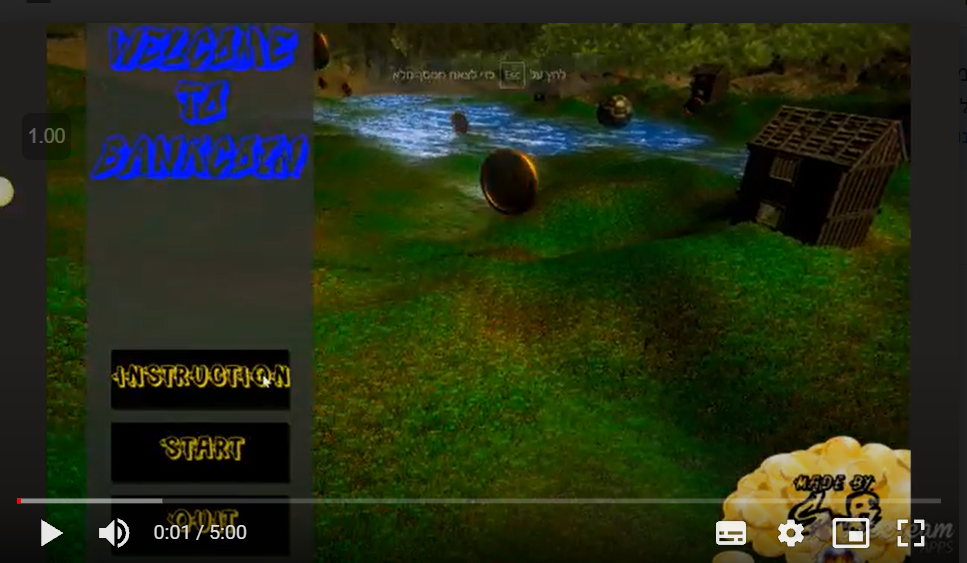
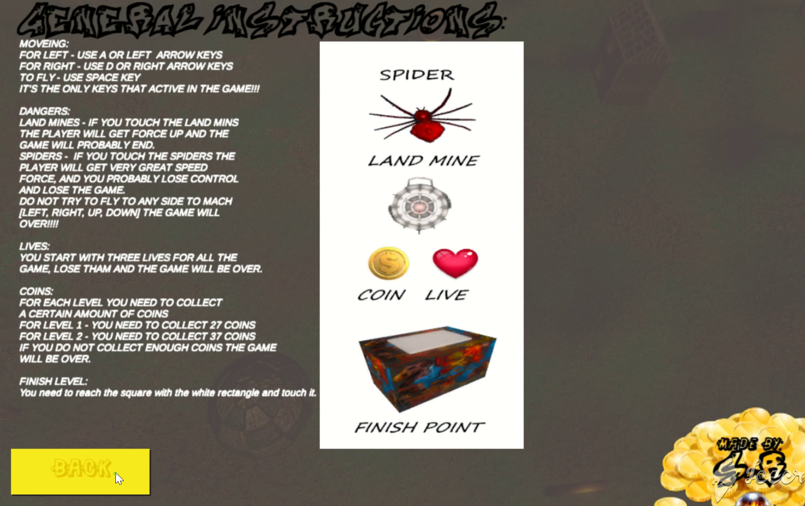
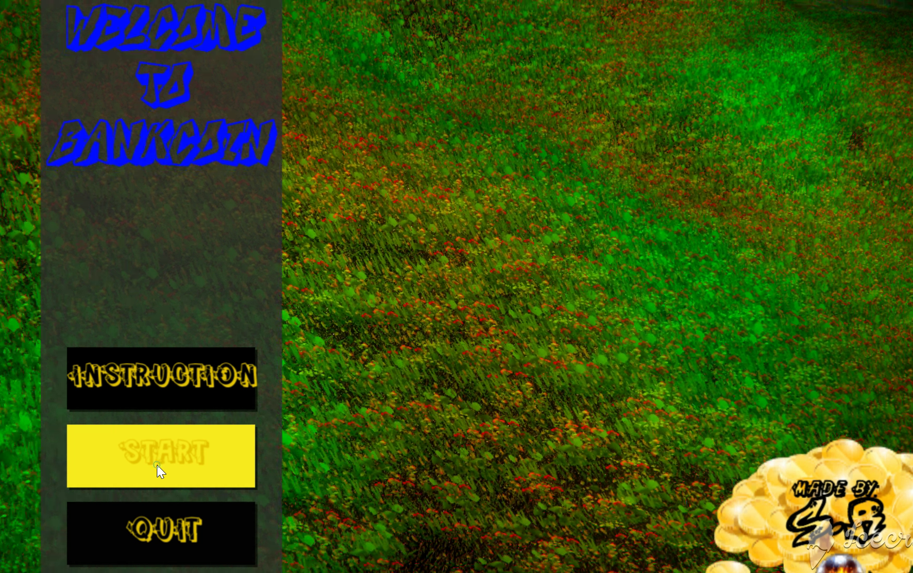
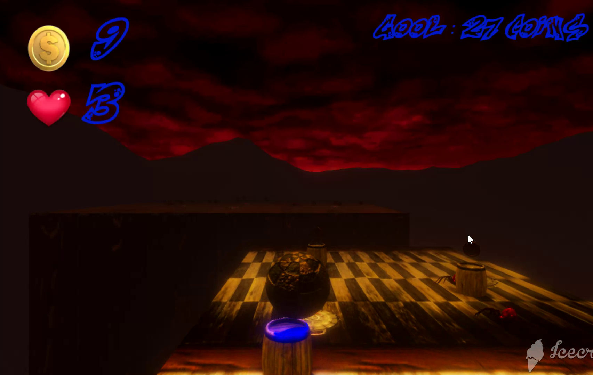
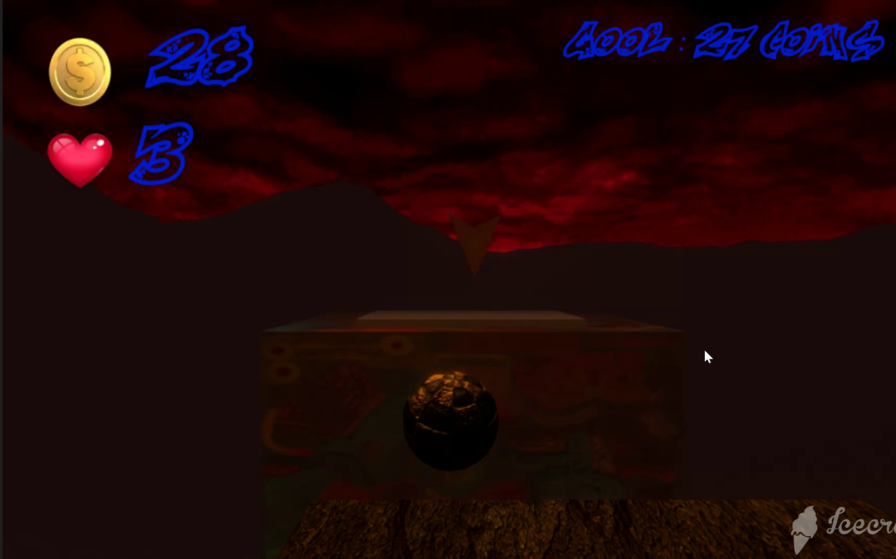
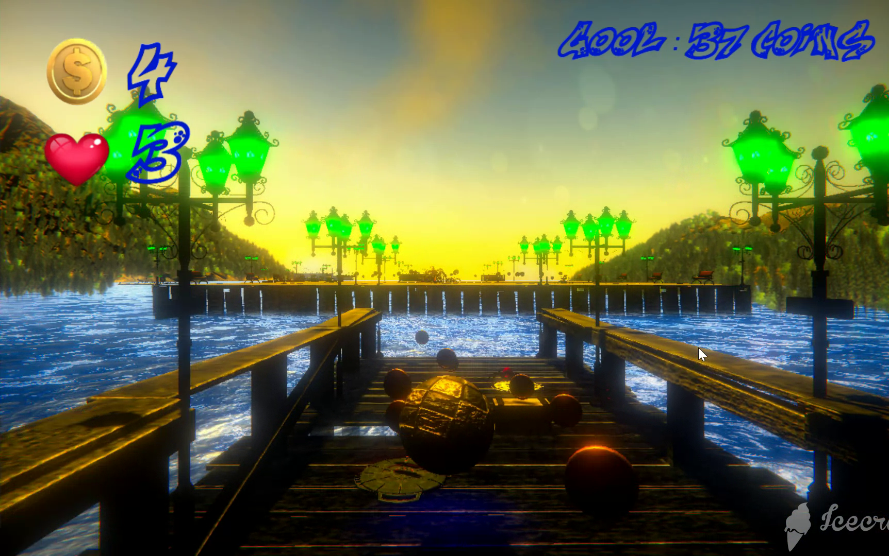
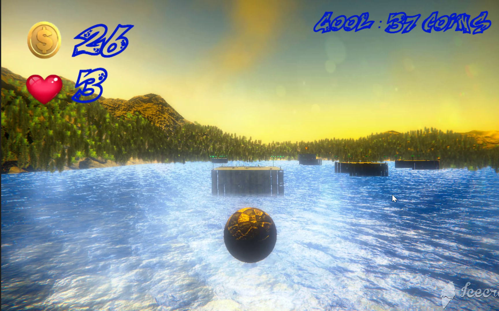
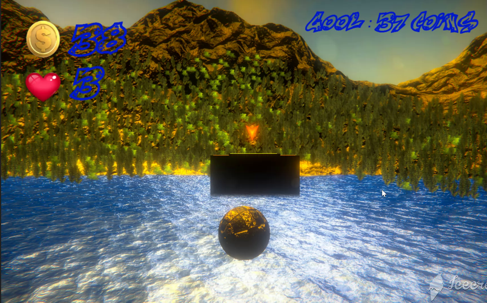

# BankCoin-Game

Coin collecting game. This game consists of two levels with varying degrees of difficulty. It includes a menu. In the game, the ball should avoid mines and spiders. Through artificial intelligence, the spiders chase the player when he enters their area. Every object in the game has its own sound. 
#### It was developed on the Unity platform using C # programming language.

### Files:
Here you will find mostly code files. The graphics, animation files, and packages used in this project are not included because of space limitations.

<a href="https://drive.google.com/file/d/1Y-kOpWTZlW3a8o4_St_8TdD-L2oaZ4gG/view?usp=sharing">Click to see the video.</a>

**Menu**

**Level 1**

**Level 2**

-----------------------------
